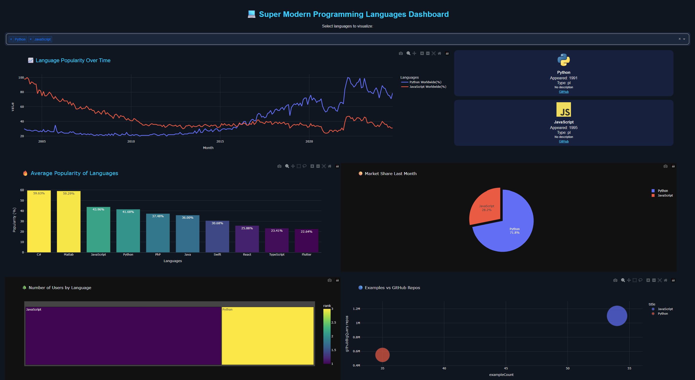

# 💻 Super Modern Programming Languages Dashboard



## 🚀 Overview
This is a **fully interactive dashboard** that visualizes programming language trends over time and provides detailed metadata about each language. It combines **popularity trends** (2004-2024) and **language database information** in a modern, stylish interface.

- Trend line chart 📈  
- Average popularity bar chart 🔥  
- Last month market share pie chart 🥧  
- Treemap for number of users 🌳  
- Bubble chart for examples vs GitHub repos 🔵  
- Dynamic cards with metadata and GitHub links  
- Responsive **dark neon theme**  

---

## 📚 Dataset Sources
1. [Most Popular Programming Languages 2004-2024](https://www.kaggle.com/datasets/muhammadroshaanriaz/most-popular-programming-languages-2004-2024?utm_source=chatgpt.com)  
2. [Programming Language Database](https://www.kaggle.com/datasets/sujaykapadnis/programming-language-database?utm_source=chatgpt.com)  

> Place the CSV files in the same folder as the `dashboard_super.py` file.

---

## 🎯 Features
- Multi-chart visualization  
- Real-time filtering of selected languages  
- Interactive hover effects  
- Logos loaded from online sources  
- Handles missing data gracefully  
- Clean dark theme optimized for readability  
- Dark/light mode ready  
- Mobile responsive layout  

---

## 🛠️ Installation

1. Clone the repository:
```bash
git clone https://github.com/phoenix-110-135/Dash.git
cd Dash
```

2. Create a virtual environment (recommended):
```bash
python -m venv venv
source venv/bin/activate  # Linux/Mac
venv\Scripts\activate     # Windows
```

3. Install dependencies:
```bash
pip install -r requirements.txt
```

4. Run the app locally:
```bash
python dashboard_super.py
```

5. Open in browser:  
[http://127.0.0.1:8050](http://127.0.0.1:8050)

---

## 🐳 Docker Usage
1. Build Docker image:
```bash
docker build -t dash-dashboard .
```

2. Run the container:
```bash
docker run -p 8050:8050 dash-dashboard
```

3. Access the app at `http://localhost:8050`

> Make sure `Dockerfile` is in the root folder alongside `dashboard_super.py` and `requirements.txt`.

---

## 🎨 Usage
- Select multiple languages from the dropdown to visualize trends.  
- Hover over charts to see exact values and comparisons.  
- Click on cards to open GitHub repositories or official websites.  
- Explore pie charts and treemaps for interactive summaries of popularity and usage.  

---

## 💡 Future Improvements
- Animated transitions between charts  
- Filter by language type (compiled, interpreted, scripting)  
- Add a dark/light mode toggle switch  
- Integrate StackOverflow & job market data dynamically  
- Save charts as images or PDFs directly from the dashboard  

---

## 👨‍💻 Author
**Phoenix** – Passionate about data visualization & programming trends

---

## 🔗 License
This project is open source and free to use under the MIT License.
